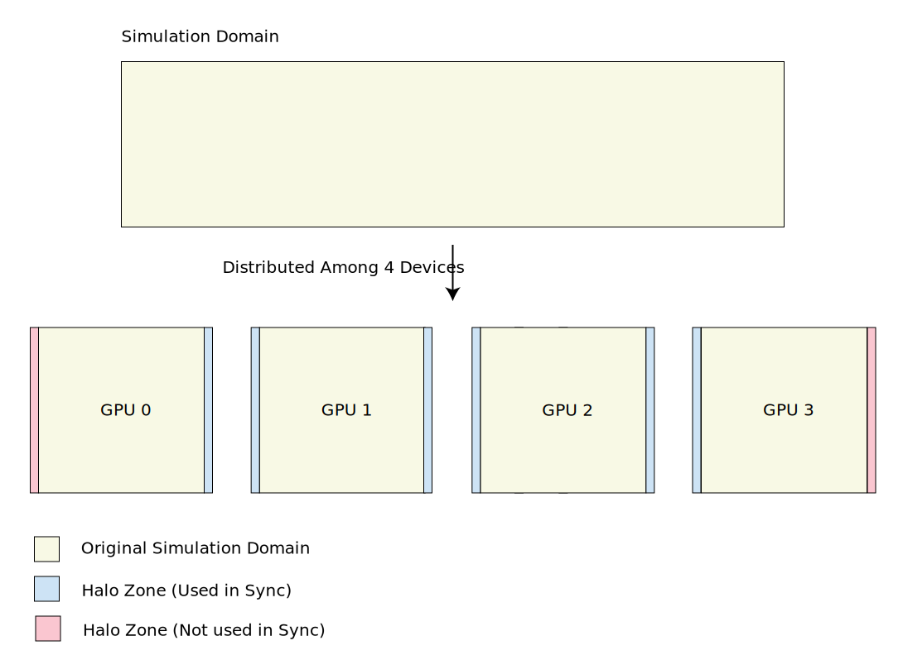
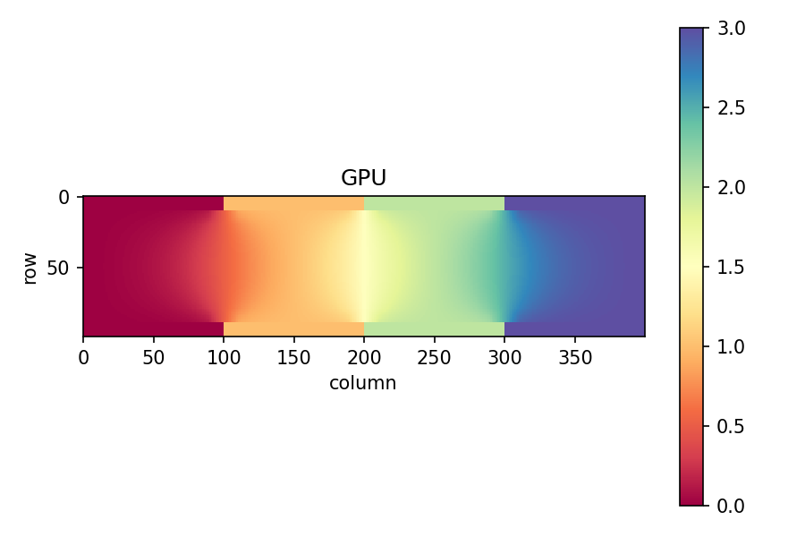
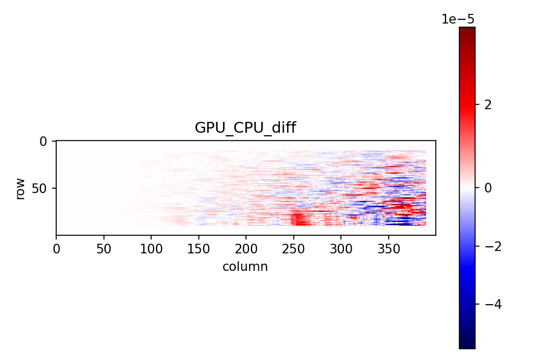

# Column-wise Halo Exchange on Multi-GPU Chain in Jax

In the first attempt, we implement only a column-wise halo exchange, after addressing the potential issues with the JAX environment setup, and also dirt internal implementation (especially making sure jit is still applicable), we can implement 2D halo exchange. 

## Problem Statement

This proof-of-concept shows how to run a column-wise domain split across multiple GPUs in JAX, exchange halo columns between neighbor devices (no wrap around), and apply a `(2h+1)×(2h+1)` box mean (pooling-like) update that uses those ghosts—all under pmap with JIT.

The following figure illustrates the halo boundaries in a 1D domain decomposition across 4 devices `(0:A, 1:B, 2:C, 3:D)`:




## Summary

- Chain topology with 4 devices (A<->B<->C<->D) (no A <->D wrap).
- Uniform local shape per device with two sided halo columns: `(nx, ny + 2 * halo)`.
- Halo copy (communication): neighbor real border columns are copied into ghost bands using `lax.ppermute` (bijection satisfied via zero payload on the wrap link).
- Ghost-using compute: a (2h+1)×(2h+1) box mean via lax.reduce_window with VALID padding (no padding), so the ghosts are actually read at subdomain interfaces.
- No global padding: we skip the physical outer border updates; only rows `halo..nx-halo-1` are written. On the chain ends, the first/last halo interior columns are restored (not updated).
- CPU reference: same update computed on the entire concatenated field on CPU for validation.


## Run on One Node with 4 GPUs

```bash
 python poc_conv_with_reduce.py --nx 100 --ny 100 --halo 10 --steps 100 --compare
 ```

## Command Line flags

`--nx` : rows per device (height)  
`--ny` : interior columns per device (width)  
`--halo` : halo width and neighborhood radius h  
`--steps` : time-steps to run  
`--ndev` : number of devices in the chain (tested with 4)  
`--compare` : also compute CPU reference and print norms  
`--debug` : extra prints for small runs  

## How it works

1. Initialization

Each device allocates `(nx, ny + 2·halo)` and is filled with its device id (0,1,2,3).
Layout per device:
```bash
[:, 0:halo]            -> left ghost
[:, halo:halo+ny]      -> interior
[:, halo+ny:halo+ny+h] -> right ghost

```

2. Halo Copy

- To fill left ghost: receive left neighbor’s right-real columns.
    - Implemented by ppermute right-shift; last device sends zeros on the wrap link.
- To fill right ghost: receive right neighbor’s left-real columns.
    - Implemented by ppermute left-shift; device 0 sends zeros on the wrap link.
- Edge devices guard writes so no ghost is written where no neighbor exists.

3. JITed box mean (compute)

- Compute a `(2h+1)×(2h+1)` VALID box mean over the local array (which includes ghosts).
- Map the result back to rows `halo..nx-halo-1` and interior columns.
- On GPU0, skip the first halo interior columns (restore old values).
    - On GPU(n-1), skip the last halo interior columns.
- Middle devices update the full interior.

4. Validation

- Build the full domain (nx, ndev·ny) by concatenating interiors from all devices.
- Run the same “VALID box mean” on CPU (NumPy) on the global field.
- Print L2 / Linf norms of the difference.

## Visualization

- GPU results



- CPU reference results


- Difference between GPU and CPU reference




## Notes

- We are using JAX's ring topology to define the device roles, however, we don't wrap the data between the first and last devices. Without the dummy buffer for the first and last devices (pink area), `lax.ppermute` raises an error.